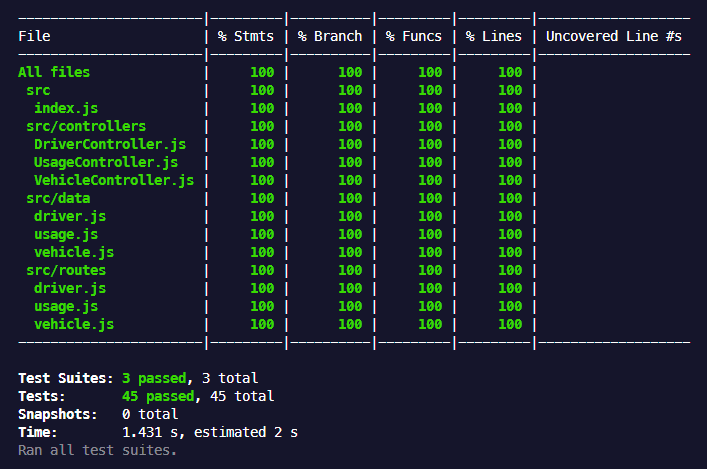

# Teste Técnico Prático

Este é um projeto JavaScript e NodeJS com Express que permite controlar a utilização dos automóveis de uma empresa.

## Configuração

1. Clone o repositório.
2. Execute `npm install` para instalar as dependências.
3. OPCIONAL - Copie `.env_example` para `.env` e preencha sua variável de ambiente.
4. Execute `npm run dev` para iniciar o servidor.

## Testes

- Execute `npm run test` para executar os testes de uma só vez.
- Execute `npm run test:co` para executar os testes em modo coverage.
- Execute `npm run test:watch` para executar os testes em modo watch.

Coverage dos testes performados - 100%

## Endpoints da API
  - ## Motoristas

    - `GET /driver`: Listar motoristas
    - `GET /driver?nome=${nome}`: Listar motoristas filtrados pelo nome
    - `GET /driver/${id}`: Obter motorista pelo id
    - `POST /driver`: Criar novo motorista. Este endpoint precisa receber um JSON com o campo 'nome'
    - `PUT /driver/${id}`: Atualizar motorista pelo id. Este endpoint precisa receber um JSON com o campo 'nome' contendo o novo nome que o motorista com o id indicado receberá no caso de atualização, caso seja para restaurar, o campo 'nome' se torna opcional
    - `DELETE /driver/${id}`: Deletar motorista pelo id
  
  *O ENDPOINT `PUT` TAMBÉM É RESPONSÁVEL POR RESTAURAR UM MOTORISTA DELETADO. DE ACORDO COM O PROJETO NA LINHA: `Recuperar um motorista cadastrado pelo seu identificador único` O ENTENDIMENTO A PARTIR DISSO FOI QUE AO DELETAR UM ITEM ELE NÃO SERIA DELETADO DE FATO, PODENDO ASSIM SER RECUPERADO POSTERIORMENTE, COMO ACONTECE NA MAIORIA DAS EMPRESAS. PORTANTO, O ENDPOINT PARA RECUPERAR O MOTORISTA DELETADO É O `PUT` PASSANDO O `ID` UMA VEZ DELETADO, TRAZENDO ELE DE VOLTA COMO ATIVO*

  - ## Veículos

    - `GET /vehicle`: Listar veículos
    - `GET /vehicle?cor=${cor}&marca=${marca}`: Listar veículos filtrados por cor e/ou marca
    - `GET /vehicle/${id}`: Obter veículo pelo id
    - `POST /vehicle`: Criar novo veículo. Este endpoint precisa receber um JSON com os campos 'placa', 'cor' e 'marca'
    - `PUT /vehicle/${id}`: Atualizar veículo pelo id. Este endpoint precisa receber um JSON com os campos 'placa', 'cor' e 'marca' contendo os novos valores que o veículo com o id indicado receberá no caso de atualização, caso seja para restaurar, os campos 'placa', 'cor' e 'marca' se tornam opcionais
    - `DELETE /vehicle/${id}`: Deletar veículo pelo id
  
  *O ENDPOINT `PUT` TAMBÉM É RESPONSÁVEL POR RESTAURAR UM VEÍCULO DELETADO. DE ACORDO COM O PROJETO NA LINHA: `Recuperar um veículo cadastrado pelo seu identificador único` O ENTENDIMENTO A PARTIR DISSO FOI QUE AO DELETAR UM ITEM ELE NÃO SERIA DELETADO DE FATO, PODENDO ASSIM SER RECUPERADO POSTERIORMENTE, COMO ACONTECE NA MAIORIA DAS EMPRESAS. PORTANTO, O ENDPOINT PARA RECUPERAR O VEÍCULO DELETADO É O `PUT` PASSANDO O `ID` UMA VEZ DELETADO, TRAZENDO ELE DE VOLTA COMO ATIVO*

  - ## Utilização de um automóvel

    - `GET /usage`: Listar utilizações com motorista e automóvel
    - `POST /usage`: Criar nova utilização. Este endpoint precisa receber um JSON com os campos 'dataInicio', 'automovelId' (id do automóvel), 'motoristaId' (id do motorista) e 'motivo'
    - `PUT /usage/${id}/end`: Finalizar utilização de veículo. Este endpoint precisa receber um JSON com o campo 'dataTermino'

## Controladores

- [`DriverController`](src/controllers/DriverController.js)
- [`UsageController`](src/controllers/UsageController.js)
- [`VehicleController`](src/controllers/VehicleController.js)

## Dados

- [`driver.js`](src/data/driver.js)
- [`usage.js`](src/data/usage.js)
- [`vehicle.js`](src/data/vehicle.js)